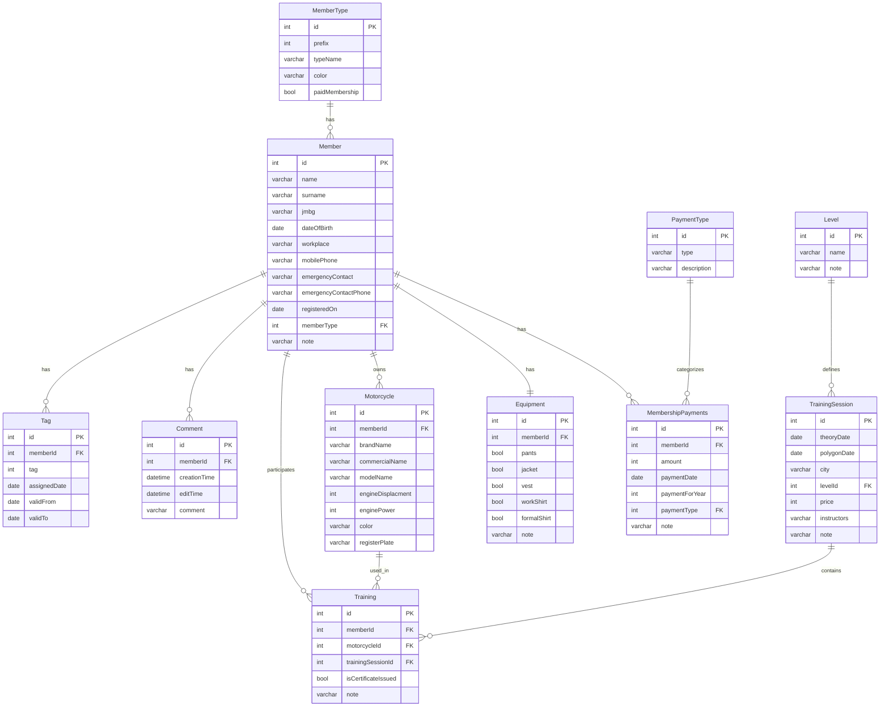

# Database Schema Diagram

This document contains the Entity Relationship Diagram (ERD) for the motoklub-bezbednost database.

## ER Diagram

## Schema Documentation

### Tables

#### Member
Main entity representing club members.
- **Primary Key**: `id`
- **Foreign Keys**: `memberType` → `MemberType.id`
- **Key Fields**: `jmbg` (unique identifier), `name`, `surname`, `dateOfBirth`

#### MemberType
Defines different types of membership (e.g., regular, premium, honorary).
- **Primary Key**: `id`
- **Fields**: `prefix` (numeric identifier), `typeName`, `color` (for UI), `paidMembership` (flag)

#### MembershipPayments
Tracks membership fee payments made by members.
- **Primary Key**: `id`
- **Foreign Keys**: 
  - `memberId` → `Member.id`
  - `paymentType` → `PaymentType.id`
- **Fields**: `amount`, `paymentDate`, `paymentForYear`

#### PaymentType
Categorizes different types of payments (e.g., annual fee, equipment fee).
- **Primary Key**: `id`
- **Fields**: `type`, `description`

#### Equipment
Tracks equipment issued to members.
- **Primary Key**: `id`
- **Foreign Keys**: `memberId` → `Member.id`
- **Fields**: Boolean flags for different equipment items (pants, jacket, vest, workShirt, formalShirt)

#### Motorcycle
Stores motorcycle information for members.
- **Primary Key**: `id`
- **Foreign Keys**: `memberId` → `Member.id`
- **Fields**: Brand, model, engine specifications, color

#### TrainingSession
Represents scheduled training sessions.
- **Primary Key**: `id`
- **Foreign Keys**: `levelId` → `Level.id`
- **Fields**: `theoryDate`, `polygonDate`, `city`, `price`, `instructors` (list of instructor names)

#### Level
Defines training levels (e.g., beginner, intermediate, advanced).
- **Primary Key**: `id`
- **Fields**: `name`, `note`

#### Training
Links members and motorcycles to training sessions.
- **Primary Key**: `id`
- **Foreign Keys**: 
  - `memberId` → `Member.id`
  - `motorcycleId` → `Motorcycle.id`
  - `trainingSessionId` → `TrainingSession.id`
- **Fields**: `isCertificateIssued` (flag), `note`

#### Comment
Stores comments/notes about members.
- **Primary Key**: `id`
- **Foreign Keys**: `memberId` → `Member.id`
- **Fields**: `creationTime`, `editTime`, `comment`

#### Tag
Stores tags associated with members with validity periods.
- **Primary Key**: `id`
- **Foreign Keys**: `memberId` → `Member.id`
- **Fields**: `tag` (tag identifier/number), `assignedDate` (when tag was assigned), `validFrom`, `validTo` (validity period)

### Relationships

1. **Member ↔ MemberType**: Many-to-One
   - Each member has one member type
   - Each member type can have many members

2. **Member ↔ MembershipPayments**: One-to-Many
   - Each member can have multiple payment records
   - Each payment belongs to one member

3. **Member ↔ Equipment**: One-to-One
   - Each member has one equipment record
   - Each equipment record belongs to one member

4. **Member ↔ Motorcycle**: One-to-Many
   - Each member can own multiple motorcycles
   - Each motorcycle belongs to one member

5. **Member ↔ Training**: One-to-Many
   - Each member can participate in multiple training sessions
   - Each training record belongs to one member

6. **Member ↔ Comment**: One-to-Many
   - Each member can have multiple comments
   - Each comment belongs to one member

7. **Member ↔ Tag**: One-to-Many
   - Each member can have multiple tags
   - Each tag belongs to one member

8. **PaymentType ↔ MembershipPayments**: One-to-Many
   - Each payment type can categorize multiple payments
   - Each payment has one payment type

9. **Level ↔ TrainingSession**: One-to-Many
   - Each level can have multiple training sessions
   - Each training session has one level

10. **TrainingSession ↔ Training**: One-to-Many
    - Each training session can have multiple training records (participants)
    - Each training record belongs to one training session

11. **Motorcycle ↔ Training**: One-to-Many
    - Each motorcycle can be used in multiple training sessions
    - Each training record references one motorcycle

## Usage

This diagram can be:
- Rendered in GitHub/GitLab markdown viewers
- Used with Mermaid Live Editor: https://mermaid.live
- Converted to images using Mermaid CLI
- Used to generate database models in your project

